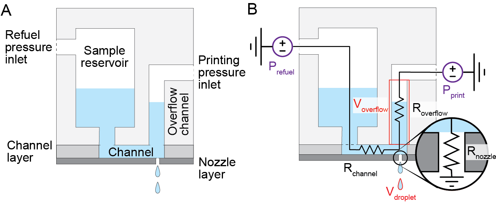

# Printing theory

  

  <strong>Figure 1</strong> Schematic depicting the printer head design. A) Labels the components of the printer head. B) Overlay of the parameters of the system. Tunable parameters: purple, fixed parameters: red, unknown parameters: black.

The complicated underlying fluid dynamics of the droplet printing system can be modeled using a simple fluid flow equation relating pressure, flow, and resistance.

  

In the above equations Q is flow, P is pressure, R is resistance, &#181; is viscoity, L is length, and r is the radius of the channel. At the scale of this system the interfacial tension and surface roughness and other unknown factors cause the resistance to not follow this idealized description. However, this equation helps depict the variables that the resistance, and therefore flow, depends on. Specifically the viscosity of the reagent and the radius of the nozzle. The major variables of this system are shown in **Figure 1** using the same notation as above.

While in an ideal world the properties of all reagents would be the same and the fabrication would be perfect, in reality these are often not true. The viscosity of different reagents can vary starkly such as comparing cell lysate to water. The fabrication, especially of the small nozzle, often varies and when the resistance of the nozzle is dependent on the radius of the hole to the fourth power small imperfections lead to deviations from the expected droplet volume. 

To address this issue, a calibration method has been developed to rapidly account for the differences in the printer head and the reagent simultaneouslly to achieve nanoliter resolution.

 

# Calibration theory

The fundamental idea of this calibration process is to leverage the fixed and tunable parameters to both determine and then account for the unknown parameters. The parameters of the system are: Unknown - Channel and nozzle resistances; Fixed - Overflow chamber volume; Tunable - Refuel and printing pressures. The primary objective of this process is to determine the printing pressure needed to eject the desired droplet volume and the refueling pressure to replenish the overflow chamber for continuous printing.

The pressures can be determined using a simple stepwise procedure beginning by calculating the unknown channel, total, and nozzle resistances

### Refuel resistance

  

  

By applying small bursts of refuel pressure, the time required to fill the volume of the overflow channel using a set pressure can be determined. Plugging these values into Equation 1 gives the resistance of the channel. 

 

### Total printing resistance

  

  

The total printing resistance is calculated using the same process as was used to find the refuel resistance except that now the printing pressure is applied in bursts and the time required to empty the overflow channel is monitored. Using Equation 2 allows for the calculation of the total printing resistance. This resistance does not represent the resistance of the nozzle as the flow out of the overflow channel is split between flowing through the nozzle and back through the channel. This value is necessary to know for later tuning the refuel pressure. By changing the channel length and width will change the resistance of the channel which will modulate how much back flow there is.

 

### Nozzle resistance

  

  

Through the process of calculating the total resistance, the ejected droplets are collected and used to calculate the volume of liquid that was displaced during the printing bursts. Using this volume and the known pressure and time of its application, the flow through the nozzle and its resistance can be calculated using Equation 3.

 

### Printing pressure 

  

  

With the calculated nozzle resistance, the required printing pressure can be calculated to print the desired droplet volume using Equation 4.

 

### Refuel pressure

  

Once the printing pressure is determined, the refuel pressure can be set to account for the displaced volume during printing. Using the calculated refuel and total printing resistances in Equation 5 allows for the calculation of the necessary refuel pressure. In Equation 5, f represents the frequency of printing and t represents the duration of each printing pulse. It is recommended to keep these parameters constant and only adjust the pressures as there are unknown changes in the resistance due to changes in those parameters. We use a pulse width of 3 msec and a frequency of 20 Hz. 

 

