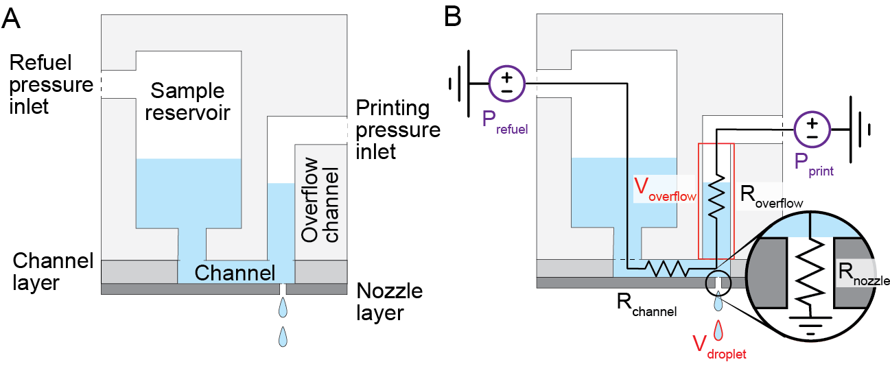

# &#181;CD microfluidic printing system
### A system for high throughput reaction generation using sub-microliter droplet printing

 

## Overview

  

The system detailed in this repository was originally described in the paper: "__________" and built upon work described in Wang, J. et al. (2019) Microfluidic cap-to-dispense (μCD): a universal microfluidic–robotic interface for automated pipette-free high-precision liquid handling. Lab Chip 19:3405-3415. This repository includes the necessary components to recreate the system shown in **Figure 1**. This repository includes the following components:
* A parts list, CAD files to 3D print or laser cut the required components, and assembly instructions [link](https://github.com/ccmeyer/printing-platform/blob/main/Documentation/assembly_description.md).

* Description of the underlying theory behind the system and how to optimize its use [link](https://github.com/ccmeyer/printing-platform/blob/main/Documentation/printing_theory_and_calibration.md).

* Description of the API required to control all components of the system [link](https://github.com/ccmeyer/printing-platform/blob/main/Documentation/API_documentation.md).

 

## Printing platform

  

  <strong>Figure 1</strong> Diagram of the complete printing platform. (A) Image of the full platform, 1) 12.5V DC power supply,  2) Dobot robotic arm, 3) Precigenome pressure regulator, 4) Analytical balance, 5) Gripper holding a printer head,  6) Valve control circuit, 7) Arduino Uno microcontroller, 8) Well plate. (B) Close up of the printer head positioned  over the reagent tube during calibration. (C) Dobot gripper with the 3D printed gripper adapters holding  a printer head. (D) Valve control circuit connected to an Arduino

The core of the μCD system is a disposable multilayer microfluidic container composed of a 3D printed reservoir linked to a microfluidic printing nozzle with two pneumatic control channels that can be reversibly connected to a robotic arm. This robotic arm is customized to enable reliable linking between the pneumatic controllers and the microfluidic device. The modular and disposable design of the μCD system allows for the inclusion of limitless reagents in a multicomponent experiment as the microfluidic devices are can be swapped in and out without risk of cross-contamination.

The printing platform is comprised of several critical components:
* The three-dimensional positioning and loading of printer heads are achieved using the Dobot magician robotic arm with the gripper attachments. 
* The printing and refuel pressures are regulated by the Precigenome pressure regulator. 
* The Arduino and valves are used to apply the pressures in bursts for printing and refueling.
* The storage and printing is carried out in the disposable microfluidic printing heads.

A detailed description of the components and assembly can be found [here](https://github.com/ccmeyer/printing-platform/blob/main/Documentation/assembly_description.md).

 

## Printing concept

  

  <strong>Figure 2</strong> Schematic depicting the printer head design. A) Labels the components of the printer head. B) Overlay of  the parameters of the system. Tunable parameters: purple, fixed parameters: red, unknown parameters: black.

The system is built upon the concept of microfluidic adaptive printing. The core principle is to apply bursts of force to liquid, squeezing it through a small ejection port (<100 &#181;m) which causes it to pinch off as a nanoliter scale droplet. In our instantiation of this system we use air pressure to exert the force and a small nozzle fabricated out of PMMA to serve as the exit port. The primary variables governing the activity of the system are highlighted in **Figure 2** and are explained in detail [here](https://github.com/ccmeyer/printing-platform/blob/main/Documentation/printing_theory_and_calibration.md).

 

## Platform API

The bulk of the API is included under the umbrella of the `Platform` class. This class includes the functions to intitially connect to and control all of the components that comprise the system. The general tasks that are routinely needed have been divided to make the customization of new protocols accessible. Several manual drive modes have been included to allow for the control of the system from the keyboard. This allows for the quick adaption of processes by the user to prototype protocols or run full experiments. 

The other class is the `PrinterHead` class which is used to track individual printer heads. This makes the tracking of volumes of the reagent are required parameters that are unique to each printer head and reagent to be tracked easily. 

The major steps required to utilize the code is detailed [here](https://github.com/ccmeyer/printing-platform/blob/main/Documentation/API_documentation.md).

 

